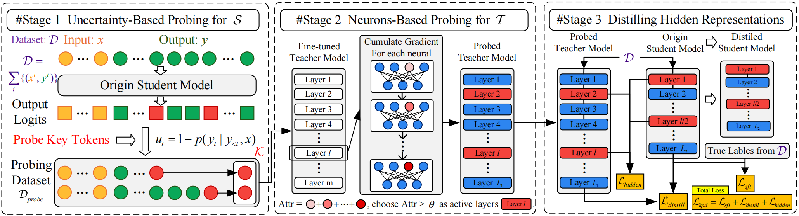

# KPD

The codes for our KPD framework.

## Framework

The overall workflow of our distillation framework, KPD, consists of three stages designed to enable precise and effective knowledge transfer. First, we probe the student model by computing the prediction uncertainty for each token and selecting those with the highest uncertainty as key tokens, which indicate the knowledge gaps. Second, we probe the teacher model to locate where the relevant knowledge is stored. Using integrated gradients, we compute attribution scores for each neuron and identify the teacher layers that are most responsible for predicting the key tokens. Third, we perform distillation from the selected teacher layers to proportionally mapped student layers using an isometric mapping strategy, minimizing the KL divergence between intermediate logits to guide the student in learning the missing knowledge. This pipeline allows our KPD to focus distillation on what the student needs and where the teacher provides it. 



## Folder Structure

The structure of the folder is shown below:

```csharp
 KPD
 ├─configs
 ├─data
 ├─data_utils
 ├─distillm
 ├─EasyEdit
 ├─examples
 ├─minillm
 ├─mpu
 ├─probe_data
 ├─probe_teacher_data
 ├─results
 ├─scripts
 ├─tools
 └README.md
```

Introduction to the structure of the folder:

- /configs: The configuration file for this project is in it.
- /data: The data for this project is stored in this directory.
- /data_utils: The data processing flow for this project is placed in this directory.
- /distillm: The official reproduction of the Distillm method is in this folder.
- /EasyEdit: A library of tools for cumulative neuronal knowledge detection on large models.
- /minillm:  The official reproduction of the Minillm method is in this folder.
- /mpu: The Transformer library for parallel computing.
- /probe_data: Probe dataset for probing teacher models.
- /probe_teacher_data: Results after probing the teacher model.
- /results: The path where the results of the model training are stored.
- /tools: Some of the tools commonly used in the code.

## Environments

Before running this project, please install the following environment:

```shell
pip install -r requirements.txt
```

## Usage

- 01 Probe the student model

```shell
python 01_probe_student.py
```

- 02 Probe the teacher model

```shell
chmod 777 ./run_02.sh
./run_02.sh
```

- 03 Distill from teacher model to student model

```shell
chmod 777 ./run_pkd
./run_pkd
```

